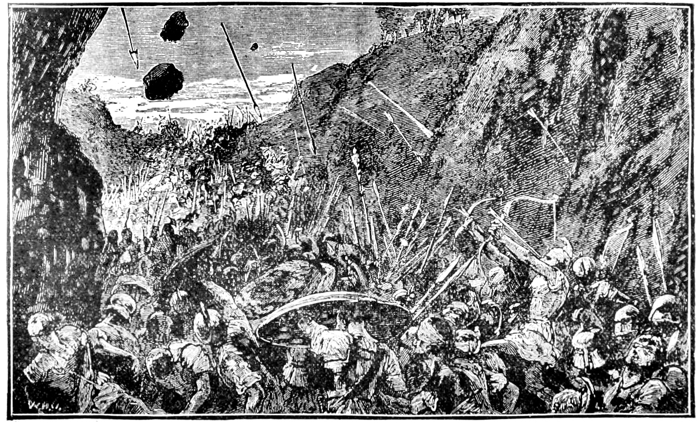

# nero

Nero is a pact, decree, and declaration created by two young men in the 21st century, who, frustrated with the poison of modern day comfort, strive for glory and honor which humanity fought for so long ago. These ambitious goals will be realized through a simple accountability system at first with a text file on GitHub, but over time, will evolve into a fully integrated and automated Jarvis-like system.

The stakes are paridoxically higher than ever before. While they have proven initial success with careers in medicine and engineering, they only have so much time before nature's decline of mental and physical ability. Will these men reach freedom by discipline, rejecting the vice of modern day comfort? Or will this journey just be another to add onto their large pile of failure?
